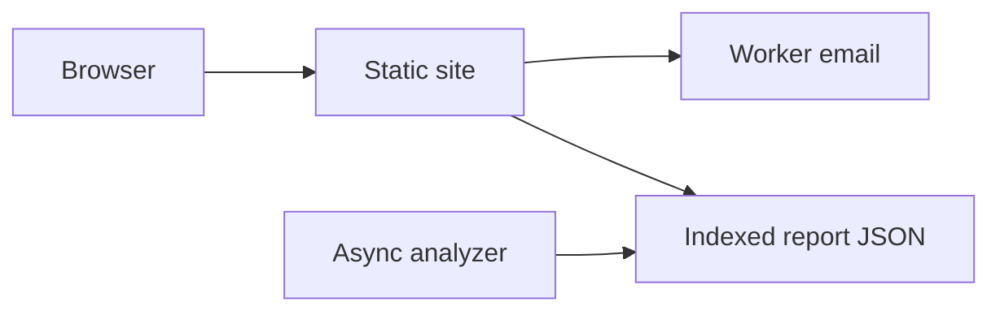

# Lean Report Card

A static website that publishes a public index of Lean 4 project scores. Submissions are emailed by a Cloudflare Worker; reports are indexed JSON files.

The score is produced by fixed mechanical checks on a pinned revision. It combines build/test/lint outcomes with source token counts, documentation comments, reproducibility files and repository-hygiene files. It is not a proof of mathematical correctness or security.

## Architecture



- **Website:** static files in `site/`. The index lists one line per published repository, with pagination. A compact form can request another analysis. A top Contact control collects a message and email. Both post to a Cloudflare Worker in `worker/`, which emails the submission to the maintainers.
- **Reports:** `site/reports/index.json` lists published files. Jobs can add JSON later without changing the site. Each published report also has a static badge at `site/badge/{owner}/{name}.svg`.
- **History and cache (legacy stack):** PostgreSQL stores repositories and historical analysis runs. A row changes state while its job runs, then remains available as history. The same commit and analyzer version reuses a queued, running or successful report unless `force=true`.
- **Queues:** Celery and Redis expose separate `small` and `big` queues. Auto classification uses GitHub repository size plus a configurable known-large set.
- **Execution:** workers launch disposable Docker runner containers. Small and big queues have different CPU, memory, Lean thread and timeout budgets.
- **Monitoring:** `/healthz`, `/readyz` and private Prometheus metrics. The website carries no analytics or tracking code.

See `docs/ARCHITECTURE.md`, `docs/SCORING.md`, `docs/SECURITY.md` and `docs/FUTURE_WORK.md`.

## Run locally

### Static website

```sh
make site
```

Open `http://127.0.0.1:8080`. A published example lives at `reports/leanprover-community/aesop.json`. `make site` serves static files only, so form posts to `/api/...` return 404; use `npx wrangler dev` to exercise the API routes, which simulates email delivery locally.

### Legacy API shell without background jobs

```sh
python -m venv .venv
. .venv/bin/activate
pip install -e '.[dev]'
mkdir -p .data
uvicorn lean_report_card.main:app --reload
```

Open `http://127.0.0.1:8000` for the older FastAPI UI, health endpoints, and API documentation.

### Full single-machine stack

Docker and the Compose plugin are required. The workers mount `/var/run/docker.sock` so they can create constrained runner containers.

```sh
cp .env.example .env
docker compose up --build
```

Open `http://localhost`. Two Celery workers listen independently:

- `small`: concurrency 2, default 2 CPU / 4 GiB / 30 minutes per job;
- `big`: concurrency 1, default 6 CPU / 12 GiB / 2 hours per job.

Each runner is hard-capped with cgroup memory plus a matching swap limit, so a Lean project with bad memory growth is killed (`oom_killed`) instead of paging the host to death. Lean itself has no heap ceiling; `LEAN_NUM_THREADS` only reduces parallelism. Tune the budgets in `.env` for the host. Keep `2 × small + 1 × big` plus about 8 GiB for the OS and control plane under physical RAM.

## API

Request or reuse a report:

```sh
curl -X POST http://localhost/api/v1/reports \
  -H 'content-type: application/json' \
  -d '{
    "repository": "https://github.com/leanprover-community/aesop",
    "queue": "auto",
    "force": false
  }'
```

Useful endpoints:

```text
GET  /api/v1/reports/{report_id}
GET  /api/v1/reports/{report_id}/raw
GET  /api/v1/repositories/{owner}/{name}/latest
GET  /api/v1/repositories/{owner}/{name}/history
GET  /badge/{owner}/{name}.svg
GET  /healthz
GET  /readyz
GET  /metrics                 # bound locally; blocked by Caddy
```

## Initial analyzer behavior

The runner currently:

1. clones the public repository and checks out the resolved commit;
2. initializes its Git submodules;
3. installs the pinned `lean-toolchain` with Elan;
4. attempts Mathlib cache retrieval when the manifest appears to use Mathlib;
5. runs `lake build`;
6. runs `lake test` and `lake lint` when their Lake drivers are detected;
7. records bounded logs and durations;
8. counts Lean files, documentation comments, tests, `sorry`, `admit`, `axiom`, `native_decide`, TODOs and common project files;
9. emits versioned JSON and an explained score.

Source scans ignore comments and strings for trust-related tokens, but remain approximations. A real axiom audit must inspect the compiled Lean environment.

## Lean tooling submodules

The repository pins integration candidates as Git submodules:

- `leanprover/lean-action`;
- `leanprover-community/axiom-audit`;
- `leanprover-community/import-graph`;
- `leanprover/reservoir`.

Run `make tooling` in a networked checkout to initialize the pinned revisions. The base runner intentionally does not require initialized submodules. Details and the adapter boundary are in `docs/TOOLING_INTEGRATION.md`.

## Form submissions

The site has no analytics or tracking code. The score and contact forms post JSON to `/api/score` and `/api/contact`, handled by the Worker in `worker/`. Each handler validates the fields and emails the submission through the `SEND_EMAIL` binding (Cloudflare Email Service).

The site itself ships as [Workers static assets](https://developers.cloudflare.com/workers/static-assets/): a request matching a file under `site/` is served without invoking the Worker, and anything else falls through to `worker/index.js`, which owns `/api/*` and defers unknown paths back to the asset handler. Because the default `html_handling` strips the extension, pages live at `/about` rather than `/about.html`; the old `.html` URLs still answer with a 307 to the new ones.

Two addresses configure delivery:

- `FORM_FROM` — sender address, in `wrangler.toml`. It must be on a domain with Email Routing or Email Sending enabled;
- `FORM_TO` — the notification mailbox. Not checked in: set it as a Worker secret, and in a local `.dev.vars` (git-ignored) for `wrangler dev`.

No API token is needed, since the binding authenticates implicitly. The forms only show their success message after the Worker returns 2xx.

Outbound Email Sending to arbitrary recipients requires the Workers Paid plan, but sends to a **verified destination address** in your own account are free on every plan and exempt from the quota — which is all this Worker does. On the Workers Free plan, `FORM_TO` must therefore be an address verified under Email Routing, and `FORM_FROM` must be on one of your routing domains.

## Development

```sh
pip install -e '.[dev]'
ruff check .
pytest
```

The CI workflow also builds both Docker images.
