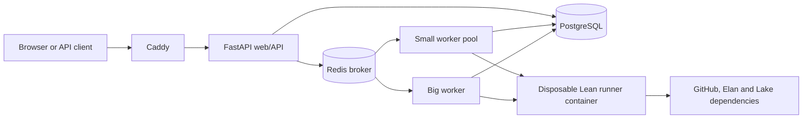

# Lean Report Card

A runnable scaffold for a single-machine service that accepts a public Lean GitHub repository, resolves an exact revision, queues a bounded analysis job, stores a report, and presents current and historical results through a small website and JSON API.

The initial score is deliberately modest in scope. It combines build/test/lint outcomes with coarse source, documentation, reproducibility and repository-hygiene signals. It is not a proof of mathematical correctness or security.

## Architecture



- **Web/API:** FastAPI plus server-rendered Jinja templates.
- **History and cache:** PostgreSQL stores repositories and historical analysis runs. A row changes state while its job runs, then remains available as history. The same commit and analyzer version reuses a queued, running or successful report unless `force=true`.
- **Queues:** Celery and Redis expose separate `small` and `big` queues. Auto classification uses GitHub repository size plus a configurable known-large set.
- **Execution:** workers launch disposable Docker runner containers. Small and big queues have different CPU, memory, Lean thread and timeout budgets.
- **Monitoring:** `/healthz`, `/readyz` and private Prometheus metrics; the GCP scaffold installs the Ops Agent and provisions an uptime check and alert policies.
- **Deployment:** Docker Compose locally; Terraform provisions one Compute Engine VM and persistent data disk.

See `docs/ARCHITECTURE.md`, `docs/SCORING.md`, `docs/SECURITY.md` and `docs/FUTURE_WORK.md`.

## Run locally

### Website shell without background jobs

```sh
python -m venv .venv
. .venv/bin/activate
pip install -e '.[dev]'
mkdir -p .data
uvicorn lean_report_card.main:app --reload
```

Open `http://127.0.0.1:8000` to inspect the UI, health endpoints, and API documentation.
Submitting a repository requires Redis, a Celery worker, and the analysis runner; use the full
stack below for an end-to-end run.

### Full single-machine stack

Docker and the Compose plugin are required. The workers mount `/var/run/docker.sock` so they can create constrained runner containers.

```sh
cp .env.example .env
docker compose up --build
```

Open `http://localhost`. Two Celery workers listen independently:

- `small`: concurrency 2, default 2 CPU / 4 GiB / 30 minutes per job;
- `big`: concurrency 1, default 6 CPU / 12 GiB / 2 hours per job.

Each runner is hard-capped with cgroup memory plus a matching swap limit, so a Lean project with bad memory growth is killed (`oom_killed`) instead of paging the host to death. Lean itself has no heap ceiling; `LEAN_NUM_THREADS` only reduces parallelism. Tune the budgets in `.env` for the host. The default GCP machine is `e2-standard-8` (8 vCPU, 32 GiB); keep `2 × small + 1 × big` plus about 8 GiB for the OS and control plane under physical RAM.

## API

Request or reuse a report:

```sh
curl -X POST http://localhost/api/v1/reports \
  -H 'content-type: application/json' \
  -d '{
    "repository": "https://github.com/leanprover-community/aesop",
    "queue": "auto",
    "force": false
  }'
```

Useful endpoints:

```text
GET  /api/v1/reports/{report_id}
GET  /api/v1/reports/{report_id}/raw
GET  /api/v1/repositories/{owner}/{name}/latest
GET  /api/v1/repositories/{owner}/{name}/history
GET  /badge/{owner}/{name}.svg
GET  /healthz
GET  /readyz
GET  /metrics                 # bound locally; blocked by Caddy
```

## Initial analyzer behavior

The runner currently:

1. clones the public repository and checks out the resolved commit;
2. initializes its Git submodules;
3. installs the pinned `lean-toolchain` with Elan;
4. attempts Mathlib cache retrieval when the manifest appears to use Mathlib;
5. runs `lake build`;
6. runs `lake test` and `lake lint` when their Lake drivers are detected;
7. records bounded logs and durations;
8. performs coarse source scans for Lean file counts, documentation, imports, tests, `sorry`, `admit`, `axiom`, `native_decide`, TODOs and common project files;
9. emits versioned JSON and an explained score.

Source scans ignore comments and strings for trust-related tokens, but remain approximations. A real axiom audit must inspect the compiled Lean environment.

## Lean tooling submodules

The repository pins integration candidates as Git submodules:

- `leanprover/lean-action`;
- `leanprover-community/axiom-audit`;
- `leanprover-community/import-graph`;
- `leanprover/reservoir`.

Run `make tooling` in a networked checkout to initialize the pinned revisions. The base runner intentionally does not require initialized submodules. Details and the adapter boundary are in `docs/TOOLING_INTEGRATION.md`.

## GCP

The `deploy/gcp` directory provisions a basic one-VM installation. After this private repository is reachable with a GitHub token:

```sh
cd deploy/gcp
cp terraform.tfvars.example terraform.tfvars
terraform init
terraform plan
terraform apply
```

The output is initially an HTTP URL by static IP. Domain ownership, DNS, HTTPS, stronger isolation, backups, abuse controls and production IAM are required before public launch.

## Development

```sh
pip install -e '.[dev]'
ruff check .
pytest
```

The CI workflow also builds both Docker images and validates Terraform.
