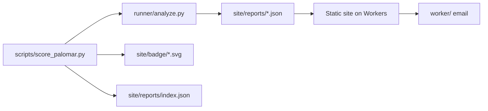

# Architecture

There is no server-side application. Analyses run locally on a maintainer's machine and commit their output; the published site is static files plus a small Cloudflare Worker for form submissions.

## Analysis lifecycle

1. `scripts/score_palomar.py` fetches the Palomar registry catalogue and derives one job per source project.
2. Progress is journalled to `.data/palomar-score/progress.json`, so an interrupted run resumes instead of repeating work.
3. Each job runs `runner/analyze.py` as a subprocess in a new session, with `~/.elan/bin` prepended to `PATH`.
4. The driver polls the process tree's resident memory and elapsed time, killing the whole group on breach. Results are recorded as `oom` or `timeout` rather than lost.
5. Raw analyzer output and a bounded log land in `.data/palomar-score/raw/{owner}/{name}.{json,log}`.
6. Successful payloads are converted to a site report and written to `site/reports/{owner}/{name}.json`, with a badge and a rewritten `site/reports/index.json`.

`--rescore-existing` recomputes scores from the JSON already under `site/reports/` and exits, which is how a scoring change is applied without cloning anything.

## Isolation

Analyses are not sandboxed. `runner/analyze.py` clones untrusted repositories and runs `lake build`, which executes arbitrary build code with the privileges of the invoking user. Memory and wall-clock ceilings are enforced by the driver, but the filesystem and network are not. Run it only on repositories you are willing to execute, or inside a disposable VM.

Lean has no compiler-level RAM cap and `LEAN_NUM_THREADS` only reduces parallelism, so the resident-memory poll is the only thing standing between a pathological project and the host's swap.

## Publishing

The site is served as Workers static assets, so `site/` needs no build step: committing a report publishes it. `site/reports/index.json` is the only file the index page reads, and reports can be added without touching any HTML.

Score and contact submissions post to the Worker in `worker/`, which validates the payload and emails it through the `send_email` binding. Delivery is the only record — there is no database and no analytics. A failed send returns 502 and the form reports the error instead of claiming success.
